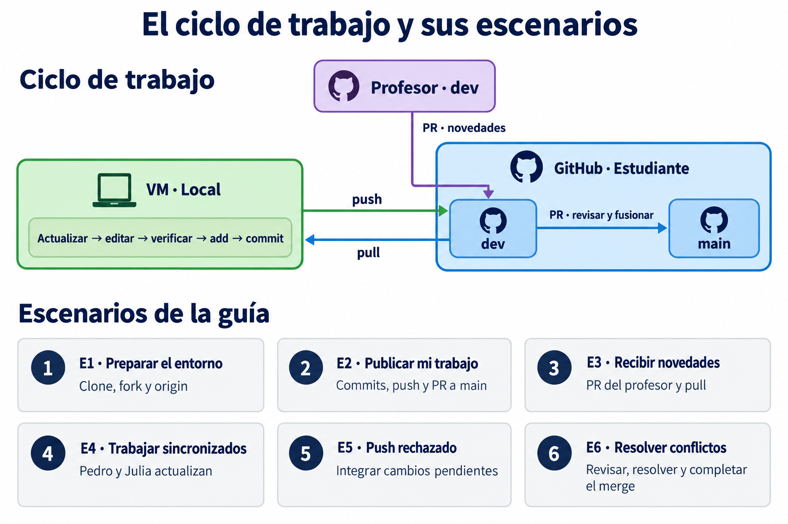
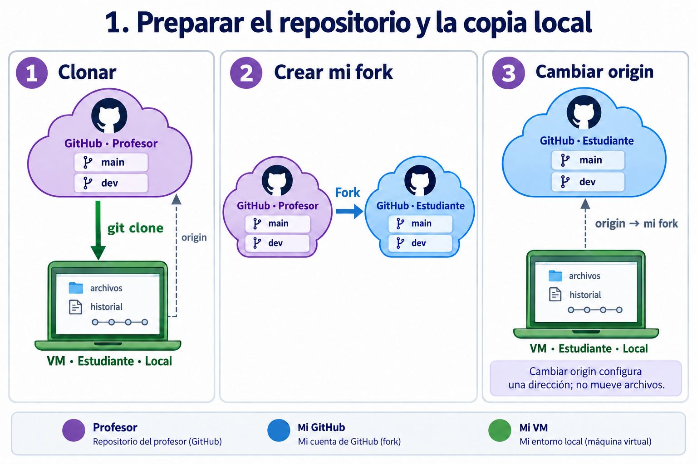
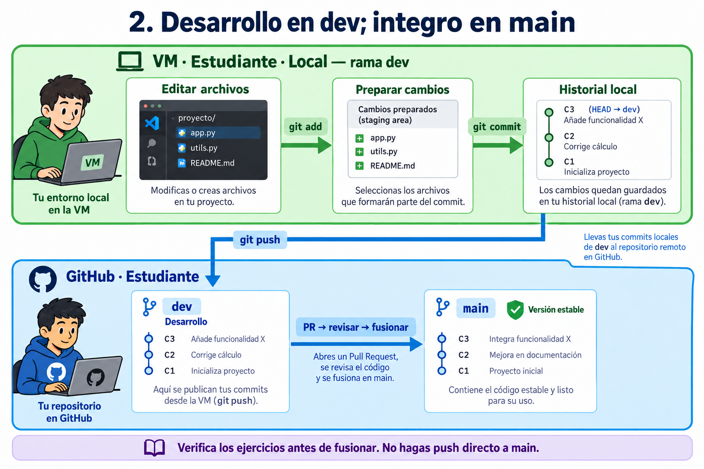
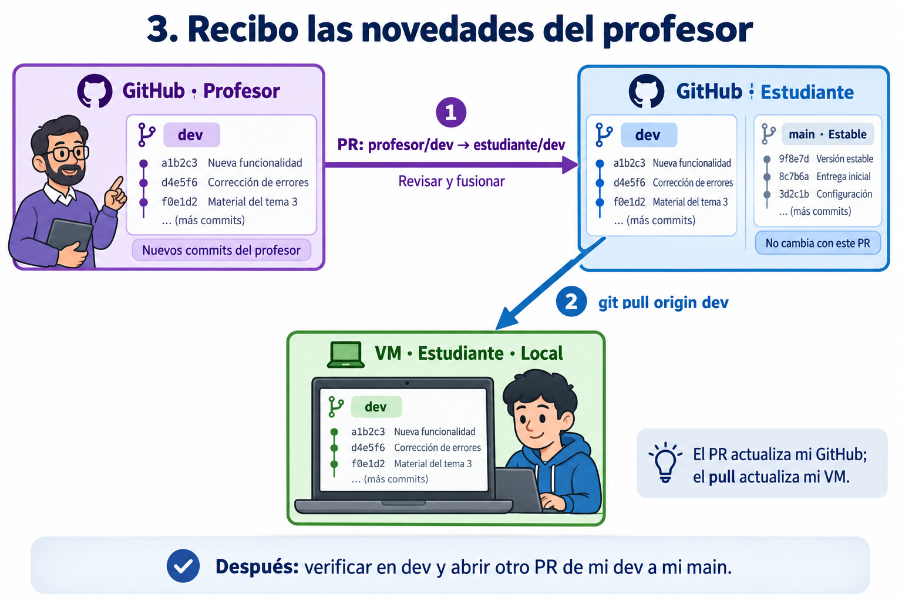
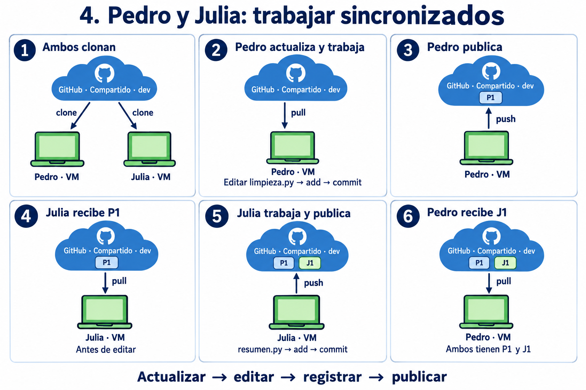
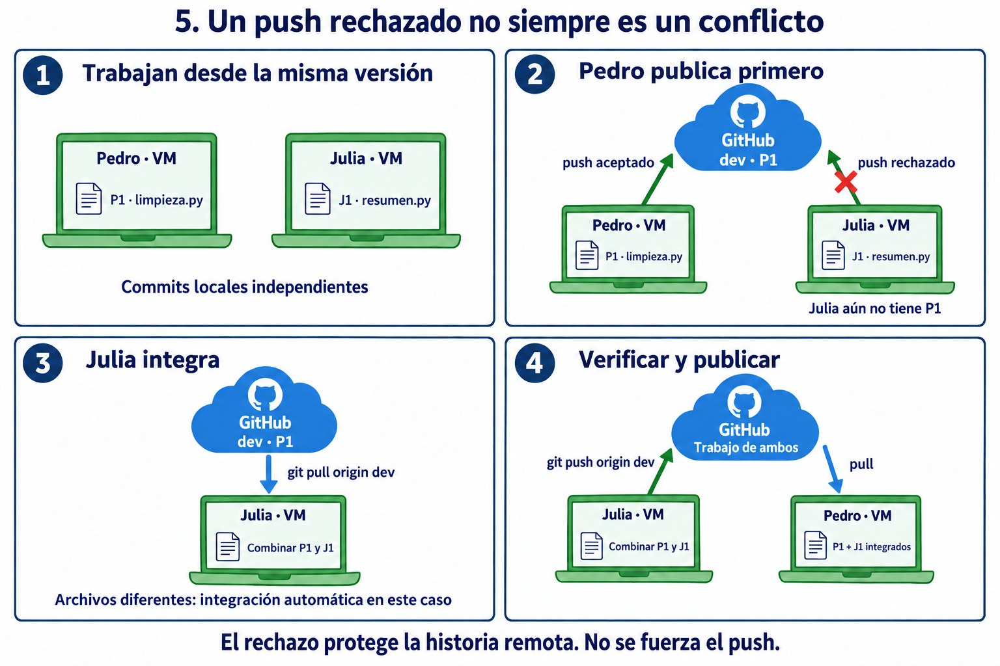
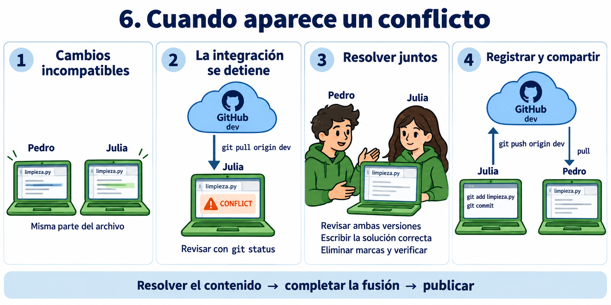
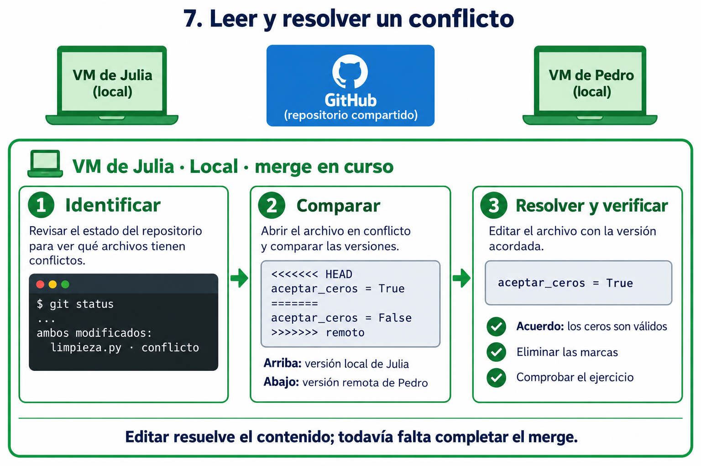
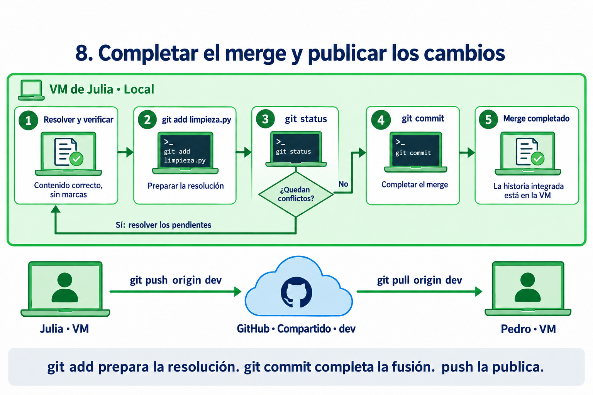

# Git y GitHub: flujo de trabajo de los ejercicios

[Versión HTML para abrir en el navegador](index.html) · [Índice del curso](../../README.md)

**Preparado por Esteban Hernandez, PhD.**

El desarrollo de software y el trabajo en datos —incluido big data— requieren registrar cambios, revisar aportes y conservar versiones verificadas. Practicaremos estas tareas con Git y GitHub: primero con los ejercicios del profesor y después con Pedro y Julia en un repositorio compartido.



Los colores identifican los ambientes. Las etiquetas E1–E6 identifican los escenarios y se repiten en sus secciones.

- **Morado: repositorio del profesor en GitHub.** Contiene el punto de partida y las novedades del curso.
- **Azul: repositorio del estudiante en GitHub.** Es el fork donde cada alumno publica y organiza su trabajo.
- **Verde: entorno local del estudiante en la VM.** Allí están los archivos que edita y el repositorio Git que registra sus commits.

**Git** mantiene el historial de versiones. **GitHub** aloja repositorios y permite revisar propuestas de integración mediante Pull Requests (PR). Una operación local no actualiza automáticamente GitHub.

<a id="e1"></a>

Escenario E1 · Preparación

## E1 · Preparar el entorno

Necesito una copia local conectada a mi propio repositorio.

El profesor publica un repositorio con las ramas `main` y `dev` y las versiones iniciales de los ejercicios. El estudiante ejecuta `git clone` desde su VM: obtiene archivos e historial y puede comenzar a trabajar localmente. Git configura un remoto llamado `origin` que, en este momento, apunta al repositorio del profesor.



Clone conecta GitHub con la VM. Fork crea un repositorio en GitHub. Cambiar origin modifica una dirección local.

Después, el estudiante crea un **fork** en su cuenta de GitHub. Ahora tiene un repositorio propio donde publicar. El fork y la copia local son distintos: crear uno no cambia automáticamente la conexión del otro.

Para conectar la copia local con su fork, ejecuta `git remote set-url origin <URL-del-fork>`. Los archivos permanecen donde estaban; lo que cambia es la dirección guardada bajo el nombre `origin`.

Finalmente, prepara y selecciona la rama local `dev`. Si ya existe, usa `git switch dev`; si no, la crea a partir de la referencia adecuada. El fork de la ilustración incluye ambas ramas: si al crearlo se copió solo `main`, también habrá que publicar `dev`.

<a id="e2"></a>

Escenario E2 · Trabajo individual

## E2 · Publicar mi trabajo

Registro mis cambios en dev y propongo su integración en main.

En `dev`, el estudiante modifica, agrega o elimina archivos. Guardar un archivo conserva su contenido en el disco; crear un commit registra una versión en el historial de Git. Son acciones diferentes.

1. **Editar:** cambiar los archivos en el área de trabajo.
2. **Preparar con git add:** seleccionar los cambios que formarán parte del siguiente commit.
3. **Registrar con git commit:** guardar esos cambios preparados en el historial local, con un mensaje que explique su propósito.
4. **Publicar con git push:** enviar los commits a `dev` del fork mediante `git push origin dev`.



El commit es local. El push publica en dev. El PR permite revisar antes de integrar en main. Los identificadores de commits son esquemáticos.

**Regla del curso: mantener main estable.** Trabajamos y publicamos en dev. No hacemos commits ni pushes directamente a main. Verificamos los ejercicios antes de integrar los cambios.

Cuando el trabajo está listo y los últimos commits están publicados, el estudiante abre un PR **de su dev hacia su main**. Este PR reúne los cambios pendientes de integración y permite revisarlos como un conjunto.

**Abrir el PR propone la integración; fusionarlo la realiza.** Una vez revisado y fusionado, `main` del fork contiene el trabajo aceptado. El PR no garantiza por sí solo que el código funcione: la estabilidad depende de las comprobaciones previas. La rama `main` local tampoco se actualiza automáticamente.

<a id="e3"></a>

Escenario E3 · Actualizaciones del profesor

## E3 · Recibir novedades

Incorporo los cambios del profesor en mi fork y actualizo mi VM.

Más adelante, el profesor publica nuevos commits en `dev`. El estudiante quiere incorporarlos conservando su trabajo. Para ello abre otro PR, esta vez **desde dev del profesor hacia dev del estudiante**.



Primero se fusiona el PR en el fork. Después se actualiza la VM mediante pull.

En GitHub, configura **base —destino—: estudiante/dev** y **head o compare —origen—: profesor/dev**. Revisa las diferencias y resuelve conflictos si aparecen antes de completar la fusión. Si requiere resolverlos localmente, esa resolución incluye trabajo adicional en la VM.

Al fusionar, las novedades quedan en `dev` del fork. Todavía no están en la VM ni en `main` del estudiante. Con el trabajo local guardado y situado en `dev`, ejecuta `git pull origin dev` para traer e integrar los cambios de su fork. Si existen cambios divergentes, será necesario completar su integración.

El estudiante comprueba los ejercicios actualizados y continúa trabajando. Cuando esa nueva versión está lista, repite el ciclo: commits locales, push a su dev y PR de su dev a su main.

### Dos PR con propósitos distintos

| Propósito | Origen | Destino | 
| --- | --- | --- |
| Integrar el trabajo verificado | Estudiante · dev | Estudiante · main | 
| Recibir novedades del profesor | Profesor · dev | Estudiante · dev |  

Presentamos primero el ciclo del estudiante y después la actualización del profesor para facilitar el aprendizaje. Este orden narrativo no es una exigencia de Git: también podemos incorporar novedades mientras desarrollamos.

## Pedro y Julia trabajan en un mismo repositorio

Hasta ahora, cada estudiante publicaba en su propio fork. Ahora Pedro y Julia comparten un repositorio de GitHub y ambos tienen permiso para publicar en `dev`. Cada uno lo clona en su VM y selecciona esa rama. Comparten el destino de sus publicaciones, pero sus archivos y commits locales son independientes: lo que Pedro cambia en su VM no aparece automáticamente en la de Julia.

- **Morado: repositorio del profesor en GitHub.** Conserva el mismo significado, aunque no interviene en estos casos.
- **Azul: repositorio compartido en GitHub.** Allí Pedro y Julia publican sus commits y reciben los aportes del compañero.
- **Verde: entorno local de cada estudiante en su VM.** Las etiquetas «Pedro · VM» y «Julia · VM» distinguen las dos copias locales, donde cada uno edita archivos y registra sus commits.

Las flechas `pull` van de GitHub a una VM; las flechas `push`, de una VM a GitHub.

Trabajarán con `limpieza.py` y `resumen.py`. Llamaremos **P1** al primer commit de Pedro y **J1** al de Julia. Son etiquetas didácticas para seguir sus aportes.

<a id="e4"></a>

Escenario E4 · Caso 1 de colaboración

## E4 · Trabajar sincronizados

Cada estudiante actualiza su copia antes de editar y publicar.

En este primer caso, Pedro publica antes de que Julia comience a editar. Así podemos observar una secuencia en la que cada aporte se construye sobre el anterior.



El repositorio compartido recibe P1 y luego J1. Cada copia local debe actualizarse para incorporar lo que publicó la otra persona.

1. **Ambos preparan su copia.** Ejecutan `git clone <URL-del-repositorio>`, entran a la carpeta y seleccionan su rama local `dev` con `git switch dev`.
2. **Pedro actualiza.** Con su área de trabajo limpia, ejecuta `git pull origin dev` antes de editar.
3. **Pedro registra y publica P1.** Modifica y comprueba `limpieza.py`; ejecuta `git add limpieza.py`, `git commit` y `git push origin dev`. Al hacer commit escribe un mensaje que describe el cambio.
4. **Julia recibe P1.** Antes de modificar sus archivos, ejecuta `git pull origin dev`. Ahora su copia incluye el trabajo de Pedro.
5. **Julia registra y publica J1.** Modifica y comprueba `resumen.py`; ejecuta `git add resumen.py`, `git commit` y `git push origin dev`.
6. **Pedro recibe J1.** Ejecuta `git pull origin dev`. Las dos copias locales y la rama compartida contienen el trabajo de ambos.

**Actualizar antes de editar reduce los desfases, pero no reserva el repositorio.** Otra persona puede publicar mientras trabajamos. El siguiente caso muestra qué ocurre entonces.

<a id="e5"></a>

Escenario E5 · Caso 2 de colaboración

## E5 · Push rechazado

Julia intenta publicar, pero le faltan los cambios de Pedro.

Volvamos al mismo punto de partida. Esta vez ambos editan al mismo tiempo: Pedro modifica `limpieza.py` y Julia modifica `resumen.py`. Cada uno registra su commit local sin haber recibido el del compañero.



El rechazo del push señala un desfase en la historia. En este caso, los cambios de archivos diferentes pueden integrarse automáticamente.

1. **Pedro publica P1.** GitHub acepta su `git push origin dev`.
2. **Julia intenta publicar J1.** Ejecuta el mismo comando, pero Git rechaza el envío: su historia local todavía no incluye P1. Puede aparecer un mensaje como `fetch first` o `non-fast-forward`. Su commit J1 sigue guardado localmente.
3. **Julia trae e integra P1.** Con J1 registrado y el área de trabajo limpia, ejecuta `git pull origin dev`. Para esta secuencia utilizamos una integración por fusión (merge), que combina las dos historias y conserva ambos aportes.
4. **Git completa la fusión.** Como en este ejemplo los cambios afectan archivos distintos sin interferencias, puede combinarlos automáticamente. Si abre el editor para el mensaje de fusión, Julia guarda el mensaje y cierra el editor.
5. **Julia verifica y publica.** Comprueba el funcionamiento conjunto y ejecuta `git push origin dev`. Si nadie ha publicado mientras tanto, el envío se acepta.
6. **Pedro actualiza su copia.** Ejecuta `git pull origin dev` para recibir la historia integrada.

**Nota para la práctica:** el comportamiento de `git pull` depende de la configuración de Git. Este ejemplo supone que se utiliza merge. Si Git pide elegir cómo integrar historias divergentes, hay que configurar esa elección con el profesor antes de continuar; el pull todavía no ha completado la integración. Mantendremos aquí los comandos básicos.

**Push rechazado no equivale a conflicto de archivos.** Git puede rechazar el envío aunque Pedro y Julia hayan editado archivos diferentes. Primero hay que incorporar la historia remota. No se fuerza el push para saltarse ese paso.

<a id="e6"></a>

Escenario E6 · Caso 3 de colaboración

## E6 · Resolver conflictos

Git detiene el merge: hay que decidir el contenido y completar la fusión.

Cambiemos una condición: ambos modifican de forma incompatible la misma parte de `limpieza.py`. Pedro publica primero y Julia intenta incorporar ese trabajo. Git no puede decidir qué contenido debe quedar y detiene la fusión para que lo revisen.



La resolución ocurre en la VM de Julia. Solo después de completar la fusión y hacer push llega al repositorio compartido.

1. **Identificar el conflicto.** Después de `git pull origin dev`, Julia ejecuta `git status` para consultar los archivos pendientes de resolución.
2. **Comparar las versiones.** Abre `limpieza.py` y revisa con Pedro qué intentaba hacer cada cambio. Las marcas de conflicto delimitan las alternativas que Git no pudo combinar.
3. **Escribir la solución.** Edita el archivo para dejar el comportamiento acordado y elimina las marcas de conflicto. Puede conservar una versión, combinar ambas o escribir una solución distinta.
4. **Comprobar el resultado.** Ejecutan el ejercicio y verifican que la resolución mantiene el funcionamiento esperado.
5. **Completar la fusión.** Julia ejecuta `git add limpieza.py` y `git commit`. Si hay varios archivos en conflicto, debe resolverlos y prepararlos todos antes del commit.
6. **Compartir la resolución.** Julia ejecuta `git push origin dev`. Después Pedro ejecuta `git pull origin dev` en su VM.

Editar el mismo archivo no siempre produce un conflicto: Git puede combinar cambios en partes distintas. Del mismo modo, una fusión automática no garantiza que el programa funcione; dos cambios pueden ser compatibles como texto y alterar su comportamiento conjunto. Por eso verificamos los ejercicios después de integrar.

### E6 · Resolución — Leer las marcas y decidir el contenido

Veamos con más detalle qué ocurre en la VM de Julia. El `git pull origin dev` trae los commits de Pedro e intenta fusionarlos con los de Julia. Si encuentra cambios incompatibles, el merge queda **en curso**: los commits de ambos se conservan, pero falta resolver el contenido y registrar la fusión.



Todo este trabajo ocurre en verde: la copia local de Julia. Editar el archivo no publica la resolución ni completa por sí solo el merge.

Supongamos que el desacuerdo está en una opción de `limpieza.py` que determina si se aceptan ceros. Julia abre el archivo y encuentra:

```
<<<<<<< HEAD
aceptar_ceros = True
=======
aceptar_ceros = False
>>>>>>> remoto
```

- **Desde `<<<<<<< HEAD` hasta `=======`:** aparece la versión local de Julia.
- **Desde `=======` hasta `>>>>>>>`:** aparece la versión remota que publicó Pedro. La etiqueta final puede ser un identificador de commit; aquí usamos «remoto» para facilitar la lectura.
- **Las marcas delimitan las alternativas:** hay que eliminarlas y dejar el código que corresponda al requisito del ejercicio.

Pedro y Julia revisan el requisito y acuerdan que los ceros son válidos. Julia deja una sola asignación, sin las marcas:

```
aceptar_ceros = True
```

Después comprueban el comportamiento del ejercicio. No basta con elegir «mi versión» o «la otra»: la resolución debe responder a lo que el programa necesita hacer.

### E6 · Finalización — Preparar la resolución y completar el merge



Primero se completa la fusión local. Después Julia publica en GitHub y Pedro actualiza su propia copia.

1. **Preparar el archivo resuelto.** Julia ejecuta `git add limpieza.py`. Git toma ese contenido como resolución del archivo; el merge sigue pendiente.
2. **Consultar lo que falta.** Ejecuta `git status`. Si quedan archivos sin resolver, repite la revisión, edición, comprobación y preparación para cada uno.
3. **Completar la fusión.** Cuando todos los conflictos están resueltos y preparados, ejecuta `git commit`, escribe o confirma el mensaje y guarda y cierra el editor. Se crea el commit de merge, que une ambas historias.
4. **Verificar el estado.** Con `git status` comprueba que la fusión terminó y que no dejó cambios pendientes por descuido. La historia integrada todavía está solamente en su VM.
5. **Publicar.** Julia ejecuta `git push origin dev`. Si otra persona publicó entretanto, deberá incorporar también esos cambios antes de volver a intentarlo.
6. **Actualizar la otra copia.** Pedro ejecuta `git pull origin dev` en su VM para recibir la resolución compartida.

**Tres estados distintos:** editar deja el contenido resuelto; `git add` prepara esa resolución; `git commit` completa la fusión. Solo el `push` publica el resultado en GitHub.

Si Git puede combinar las versiones sin conflictos, no hace falta esta resolución manual: puede completar el merge automáticamente, aunque igualmente debemos comprobar el resultado antes de publicarlo. Estos ejemplos mantienen la integración por merge indicada en el caso 2.

## Revisar el trabajo e integrarlo en main

Los tres casos ocurren en `dev`. Cuando Pedro y Julia han integrado y comprobado su trabajo, abren un PR **desde dev hacia main del repositorio compartido**, revisan el conjunto de cambios y lo fusionan. Así mantienen la misma regla del curso: desarrollar en `dev` y conservar en `main` una versión verificada.

| Situación | Qué ocurre | Qué hacemos | 
| --- | --- | --- |
| Copia local atrasada sin commits propios pendientes | Faltan cambios del compañero | Actualizar con pull | 
| Ambos tienen commits nuevos | Las historias han divergido; el push puede ser rechazado | Traer e integrar, verificar y publicar | 
| Conflicto al integrar | Git necesita una decisión sobre el contenido | Resolver, preparar, completar la fusión y publicar |  

<a id="desafio"></a>

Desafío · Práctica integradora

## Ahora te toca: un análisis de datos en equipo

Seis escenarios para practicar y revisar el trabajo con un compañero.

Trabaja con un compañero. El profesor entrega un repositorio con las ramas `main` y `dev`, un archivo de datos de ventas y dos programas: `limpieza.py` y `resumen.py`. El objetivo es preparar los datos y obtener las ventas totales por categoría, conservando el historial y una versión estable del trabajo.

- **Morado: repositorio del profesor.** Contiene los ejercicios y las actualizaciones que se publicarán durante la práctica.
- **Azul: repositorios en GitHub.** Primero, el fork de cada estudiante; después, uno de esos repositorios será el espacio compartido de la pareja.
- **Verde: VM de cada estudiante.** Cada integrante trabaja en su propia copia local.

<a id="desafio-e1"></a>

### Desafío E1 · Preparar el entorno

**Situación:** tienes acceso al repositorio del profesor y una VM. Necesitas una copia local y un repositorio propio en GitHub.

- ¿Cómo prepararías ambos espacios siguiendo el orden trabajado en clase?
- ¿Cómo comprobarías que tu copia local está conectada a tu fork?
- ¿Cómo verificarías que estás trabajando en `dev` y que esa rama existe también en tu repositorio de GitHub?

<a id="desafio-e2"></a>

### Desafío E2 · Publicar mi trabajo

**Situación:** los datos contienen filas sin categoría. Debes adaptar `limpieza.py` para identificarlas y excluirlas del análisis.

- ¿Qué modificarías y cómo comprobarías que el programa conserva las filas válidas?
- ¿Cómo organizarías tus cambios en commits cuyo propósito pueda entender otra persona?
- ¿Qué evidencia mostraría que tus commits están publicados en `dev`?
- ¿Cómo propondrías su integración en `main` y qué revisarías antes de aceptarla?

<a id="desafio-e3"></a>

### Desafío E3 · Recibir novedades del profesor

**Situación:** el profesor publica en su `dev` nuevos datos de prueba y una corrección en las instrucciones. Tu fork todavía no contiene esas novedades.

- ¿Qué repositorio y rama seleccionarías como origen y destino de la propuesta de integración?
- ¿Cómo comprobarías que conservaste tu solución al incorporar las novedades?
- ¿Qué tendría que ocurrir para que las actualizaciones estuvieran también en tu VM?
- ¿Qué comprobaciones repetirías antes de incorporarlas a tu `main`?

<a id="desafio-e4"></a>

### Desafío E4 · Trabajar sincronizados

**Situación:** elijan uno de sus forks como repositorio compartido y habiliten el acceso del compañero. Ambos deben tener una copia local conectada a ese repositorio. Un integrante mejorará `limpieza.py`; el otro añadirá el resumen por categoría en `resumen.py`. En esta ronda, el primero publicará antes de que el segundo comience a editar.

- ¿Cómo verificarían que ambos trabajan contra el mismo repositorio y sobre la rama acordada?
- ¿Cómo organizarían la secuencia para que el segundo integrante incorpore el aporte del primero antes de trabajar?
- ¿Cómo demostrarían que, al terminar, ambas VM contienen los aportes de los dos?
- ¿Qué prueba permitiría comprobar que la limpieza y el resumen funcionan juntos?

<a id="desafio-e5"></a>

### Desafío E5 · Push rechazado

**Situación:** comiencen otra ronda desde una versión común. Cada integrante modifica un archivo diferente y registra su trabajo localmente. Uno publica primero; el otro intenta publicar sin haber recibido ese cambio.

- ¿Qué mensaje aparece y qué indica sobre el estado de las copias?
- ¿Cómo comprobarían que el trabajo del segundo integrante sigue guardado?
- ¿Cómo integrarían ambos aportes sin sobrescribir el trabajo del compañero?
- ¿Qué evidencia permitiría distinguir un rechazo del push de un conflicto en los archivos?
- ¿Cómo verificarían el resultado antes de volver a publicarlo?

<a id="desafio-e6"></a>

### Desafío E6 · Resolver conflictos

**Situación:** partan de una versión común en la que `limpieza.py` contiene `aceptar_ceros = None`. Sin intercambiar cambios durante la edición, un integrante lo modifica a `True` y el otro a `False`. Ambos registran su modificación. Uno publica primero y el otro intenta integrar ese trabajo mediante merge.

- ¿Dónde se detiene la integración y cómo identificarían el archivo pendiente?
- ¿Qué representa cada versión dentro de las marcas de conflicto?
- Si el requisito establece que las ventas de valor cero son válidas, ¿qué contenido debería quedar y por qué?
- ¿Qué prueba usarían para comprobar la resolución?
- ¿Cómo distinguirían un archivo editado de una resolución preparada y de un merge completado?
- ¿Cómo conseguirían que el resultado acordado estuviera en GitHub y en las dos VM?

Cierre del desafío

### Revisión entre compañeros

- ¿Puede otra pareja reconstruir lo ocurrido utilizando sus commits y PR?
- ¿Qué evidencia presentarían para cada escenario, indicando el repositorio, la rama y el estado local?
- ¿Cómo demostrarían que `main` contiene una versión verificada y que ningún cambio se publicó directamente en ella?
- ¿Qué dificultades encontraron y qué cambiarían en su forma de coordinar el trabajo?

Ilustraciones creadas con la herramienta integrada de generación de imágenes. Referencias: [Pull Requests en GitHub](https://docs.github.com/en/pull-requests/how-tos/create-pull-requests/creating-a-pull-request), [git pull](https://git-scm.com/docs/git-pull) y [rechazo de pushes por historias divergentes](https://docs.github.com/en/get-started/using-git/dealing-with-non-fast-forward-errors).
